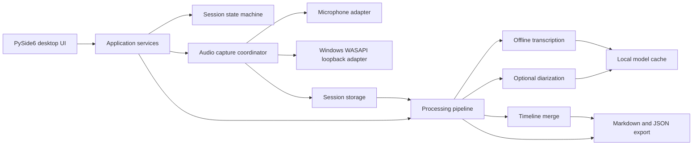
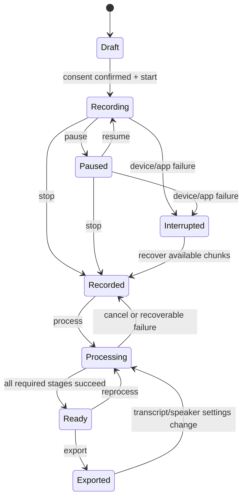

# Technical architecture

## Architectural decision

Use a Python 3.12 application with a PySide6 desktop interface and strict module
boundaries around platform audio capture, speech processing, storage, and export.

Python keeps the application close to the strongest local speech-processing
ecosystem. PySide6 provides a native desktop UI and an official deployment path
for Windows, macOS, and Linux. Windows is the first target; other operating
systems will be added through capture adapters rather than conditionals spread
throughout the application.

## High-level design



## Proposed stack

| Concern | Initial choice | Reason |
| --- | --- | --- |
| Language | Python 3.12 | Mature audio/ML ecosystem and straightforward Windows development |
| UI | PySide6 with Qt Widgets | Native desktop controls, accessibility support, and official deployment tooling |
| Audio capture | PyAudioWPatch behind a Windows WASAPI adapter | Exposes microphones and virtual loopback inputs while keeping the dependency replaceable |
| Audio format | Timestamped PCM/WAV chunks during capture | Simple, broadly supported, and recoverable after interruption |
| Transcription | faster-whisper/CTranslate2 | Local CPU/CUDA inference, timestamps, VAD, and multiple model sizes |
| Speaker diarization | Optional pyannote pipeline | Established diarization tooling; isolated because model access and compute vary |
| Canonical data | Versioned JSON documents | Allows deterministic re-export and schema migrations |
| Human output | Markdown | Portable, searchable, editable, and readable without the app |
| Settings | Versioned local configuration | Transparent migrations and no account requirement |
| Packaging | `pyside6-deploy` evaluated first | Official PySide6 deployment tool; create a signed Windows installer later |
| Tests | pytest plus recorded fixtures | Unit, pipeline, and end-to-end coverage without live meetings in CI |

PyAudioWPatch `0.2.12.8` was selected by the capture spike and is locked for
Windows. Packaging dependencies remain provisional until the release spike.

## Module boundaries

The expected source layout is:

```text
src/meeting_transcriber/
  app/                 # use cases, state machines, dependency wiring
  domain/              # session, audio, transcript, and export models
  capture/             # interfaces plus Windows implementation
  processing/          # transcription, diarization, merge, and cleanup
  storage/             # manifests, atomic writes, migrations, model cache
  export/              # Markdown and canonical JSON renderers
  ui/                  # PySide6 windows, dialogs, models, and workers
  infrastructure/      # logging, credentials, platform paths, diagnostics
tests/
  unit/
  integration/
  fixtures/
```

The domain and application layers must not import PySide6, Windows APIs, or a
specific ML provider. This keeps processing testable and allows later CLI/batch
entry points without duplicating core logic.

## Session state machine



State changes are persisted atomically in `session.json`. UI state is derived
from this persisted model; it is not the source of truth.

Consent is stored as versioned session metadata containing the confirmation time,
the statement version, and the approved capture sources. A legacy timestamp from a
schema-v1 session remains readable but is not accepted as current consent. The
recording application service enforces this startup order:

1. Require the explicit acknowledgement from the current setup screen.
2. Verify that the meeting volume is above the critical free-space threshold.
3. Rediscover and validate the selected microphone and loopback endpoints.
4. Persist current, source-specific consent.
5. Persist the session's transition to `recording`.
6. Construct and start both capture streams.
7. Mark the session `interrupted` if startup or shutdown fails.

The UI only displays its recording state after the capture coordinator reports a
successful start. Device enumeration is read-only and may occur before consent;
opening a stream may not.

The optional source test follows the same acknowledgement, endpoint-validation,
and consent-persistence boundary, but reads only enough PCM to publish levels. It
does not create a capture journal or WAV file and both streams close after five
seconds. Starting a recording while the test owns the devices is prohibited.

## Audio capture design

The capture coordinator opens two independent streams:

- `microphone`: the selected input device, initially attributed to `You`
- `system`: WASAPI loopback for the selected Windows render endpoint

Each stream writes small numbered WAV chunks and records monotonic start/end
timestamps in the session manifest. Writing chunks limits crash loss and makes it
possible to resample/re-align the streams during processing. Raw streams are not
destructively mixed during recording.

The capture journal is atomically replaced whenever a chunk is finalized. It
retains each source's start offset, format, device fingerprint, chunk boundaries,
and interruption errors so completed chunks remain discoverable after a crash.

Live meters are derived from normalized signed-16-bit PCM peaks on capture worker
threads. Workers publish only immutable level snapshots; the application service
stores the latest values under a lock and the Qt thread polls them. Meter callbacks
are non-critical and cannot terminate recording.

Pause waits for both workers to acknowledge a buffer boundary, then stops both
device streams. Resume restarts both streams and begins a new monotonic timeline
segment, preserving the real paused gap in chunk metadata. Stop is valid while
either recording or paused.

The system channel may contain multiple remote speakers. It may also contain the
local user's voice if the meeting software plays sidetone or echo. Timeline merge
must therefore retain confidence and source-channel metadata instead of assuming
that a channel always identifies a unique person.

## Processing pipeline

1. Validate the manifest and audio chunks.
2. Normalize sample rate/channel layout into derived working audio.
3. Detect speech and transcribe each source with timestamps.
4. Treat microphone speech as `You` unless the user changes it.
5. If enabled, diarize the system stream into anonymous speaker clusters.
6. Align transcript words/segments with diarization turns.
7. Merge both streams on a single timeline while preserving overlaps.
8. Write a versioned canonical `transcript.json` atomically.
9. Render deterministic Markdown from canonical data and user edits.

Every stage receives immutable inputs and writes a new artifact plus status. A
failure in diarization must not invalidate a successful transcription.

The optional diarization stage uses a revision-pinned local copy of pyannote
Community-1 and its exclusive speaker turns. A completed-download marker prevents a
partial model directory from being treated as a valid cache. Hugging Face access is
needed only for the explicit gated download; the temporary token is passed in memory
and is not part of the persisted transcription job. Pyannote metrics are disabled
before its runtime is imported. Known setup and inference failures become a
persisted nonfatal job warning and leave the source-aware transcript usable.

## Session storage

```text
Meetings/
  2026-08-10_143000_weekly-sync/
    session.json
    capture.json
    audio/
      microphone_0001.wav
      microphone_0002.wav
      system_0001.wav
      system_0002.wav
    derived/
      microphone_normalized.wav
      system_normalized.wav
      transcripts/
        <run-id>.json
      diarization/
        <run-id>.json
      meeting-notes/
        <run-id>.md
      reviews/
        <run-id>/
          revision-000001.json
    transcript.json
    diarization.json
    transcript-review.json
    meeting-notes.md
    logs/
      processing.log
```

Large/audio/model artifacts must never be committed to Git. Generated artifacts
will be safe to remove and recreate except for the source `audio/` chunks and
explicit user edits stored in the canonical documents.

On startup, persisted `recording` or `paused` sessions cannot still own a live
stream, so they transition to `interrupted`. The application labels a session
recoverable only when both `capture.json` and at least one finalized WAV chunk are
present. Explicit recovery advances that session to `recorded`; missing-artifact
sessions remain interrupted for diagnostics.

## Review overlay

`transcript.json` is immutable model output. User changes are stored separately in
`transcript-review.json` as sparse speaker-name, segment-text, segment-speaker, and
structured-note corrections tied to one transcript run. The current schema is
version 3 and the loader remains backward-compatible with schemas 1 and 2. Speaker
assignment is constrained to speakers from the segment's captured source. Every
saved change is retained under
`derived/reviews/<run-id>/`, allowing audit and recovery without copying the full
transcript.

Rendering applies the current review overlay to the canonical transcript in memory,
then writes `meeting-notes.md`; it never rewrites `transcript.json`. A new
transcription run may inherit stable speaker-name corrections for matching speaker
IDs plus the meeting-level summary, decisions, and action items. It drops segment-text
and segment-speaker corrections because segment IDs and model output are run-specific.

## Canonical transcript schema (conceptual)

```json
{
  "schema_version": 1,
  "session_id": "uuid",
  "language": "en",
  "speakers": [
    {"id": "local", "display_name": "You", "source": "microphone"},
    {"id": "speaker-1", "display_name": "Speaker 1", "source": "system"}
  ],
  "segments": [
    {
      "id": "segment-uuid",
      "start_ms": 1500,
      "end_ms": 4200,
      "speaker_id": "speaker-1",
      "text": "Example transcript text.",
      "source_channel": "system",
      "confidence": 0.91
    }
  ],
  "sections": {
    "summary": "",
    "decisions": [],
    "action_items": []
  }
}
```

The implemented schema will be validated, versioned, and migrated. User edits
must be stored separately from generated values where necessary so reprocessing
does not silently overwrite them.

## Threading and process isolation

- The Qt main thread owns UI objects only.
- Recording uses bounded worker threads with backpressure and explicit device
  failure events.
- ML processing runs outside the UI thread and should move to a child process if
  cancellation or native-library stability requires it.
- UI progress is based on persisted job state and signals, not direct blocking
  calls.

## Security and privacy

- Local processing is the default and must work without an account.
- Every meeting requires a fresh consent acknowledgement before a stream opens.
- A persistent recording indicator and stop control remain visible while capture
  is active; navigation is disabled until capture is finalized.
- The application never uploads audio implicitly.
- Any future cloud/LLM provider is opt-in per setting and clearly marks which data
  leaves the computer.
- API credentials use Windows Credential Manager rather than project files.
- Logs include identifiers, durations, stage transitions, and errors, but not raw
  transcript content by default.
- Export and deletion actions show exact target folders.

## Quality strategy

- Unit-test state transitions, schemas, merge logic, and Markdown rendering.
- Integration-test capture against synthetic/virtual devices where practical.
- Maintain short, licensed audio fixtures with known words and speaker turns.
- Add a one-hour soak test for clock drift, disk use, memory, and recovery.
- Audit real soak manifests for WAV/header integrity, chunk sequence and timeline
  continuity, minimum duration, and no more than 250 ms end-alignment drift.
- Test CPU-only systems as the baseline; CUDA is an acceleration path.
- Build the Windows artifact in CI and smoke-test it on a clean virtual machine.

## Primary-source references

- [Microsoft WASAPI loopback recording](https://learn.microsoft.com/en-us/windows/win32/coreaudio/loopback-recording)
- [PyAudioWPatch](https://github.com/s0d3s/PyAudioWPatch)
- [Qt for Python documentation](https://doc.qt.io/qtforpython-6/)
- [Qt for Python deployment options](https://doc.qt.io/qtforpython-6/deployment/index.html)
- [faster-whisper](https://github.com/SYSTRAN/faster-whisper)
- [pyannote.audio](https://github.com/pyannote/pyannote-audio)
